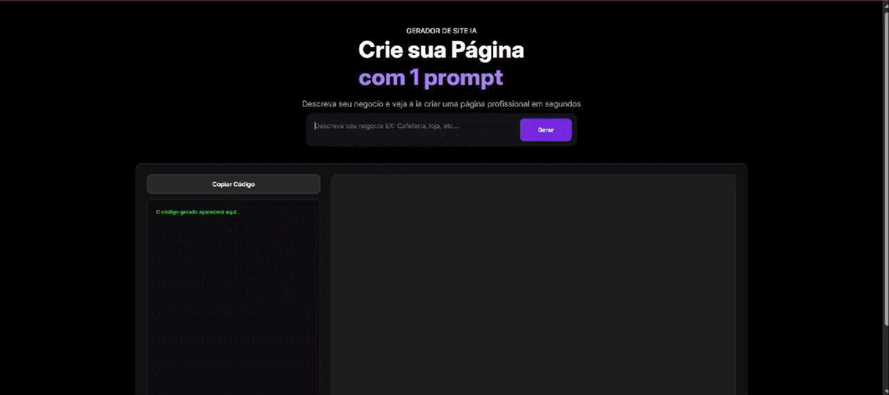

# 🚀 Criador de Páginas Web com Inteligência Artificial

Um SaaS (Software as a Service) compacto que utiliza a API da Groq e o modelo **Llama 3.3 70B** para gerar Landing Pages completas, estilizadas e responsivas a partir de um único comando de texto (prompt) do usuário.

---

## 📺 Demonstração do Projeto Funcionando

Aqui está o gerador criando uma estrutura de site em tempo real e aplicando o recurso de cópia automática do código:




---

## 🛠️ Tecnologias Utilizadas

- **HTML5 & CSS3:** Estrutura moderna da interface com gradientes, sombras e responsividade.
- **JavaScript (ES6+):** Lógica assíncrona para requisições de API (`fetch`), manipulação dinâmica do DOM (`srcdoc` em `iframe`) e manipulação da Área de Transferência.
- **Groq API (Llama 3.3 70B):** Motor de inteligência artificial de altíssima velocidade para geração de código puro.

---

## 🔒 Como Executar Localmente (Segurança)

Por motivos de segurança e boas práticas, a chave de API original foi omitida do código público. Para testar o projeto no seu computador:

1. Faça o clone ou baixe os arquivos deste repositório.
2. Acesse o console da [Groq Cloud](https://console.groq.com/) e crie uma API Key gratuita.
3. Abra o arquivo `scripts.js` no seu editor de código e substitua o texto no campo de autorização:
   ```javascript
   "Authorization": "Bearer SUA_CHAVE_AQUI"
